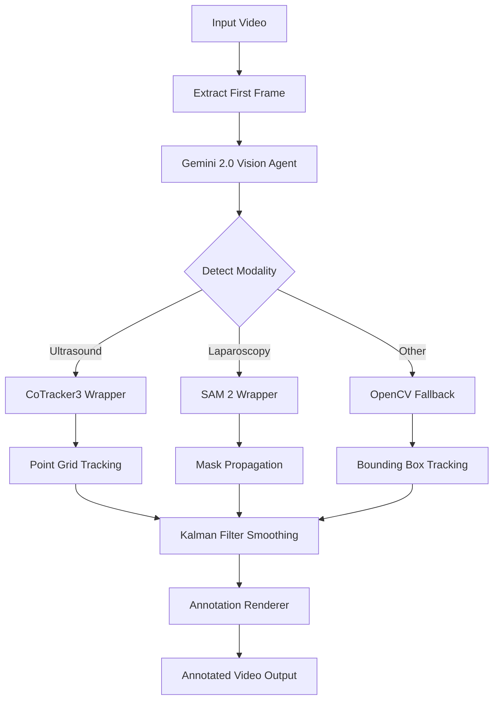

# Architecture: How It Works

This document explains the technical design and decision-making behind the HoloXR Motion Tracker pipeline.

---

## Pipeline Flow



### Step-by-Step Process

1. **Video Input**
   - System discovers videos from structured directory (`data/Echo/`, `data/Lapchole/`, etc.)
   - Extracts first frame for initial analysis

2. **Vision Agent (Gemini 2.0 Flash)**
   - Analyzes first frame using multimodal AI
   - Returns:
     - **Modality:** `Ultrasound` | `Laparoscopy` | `Other`
     - **ROI Coordinates:** `(x, y)` pixel location
     - **Clinical Label:** e.g., "Mitral valve leaflets", "Gallbladder with wall thickening"
     - **Confidence:** `0.0 - 1.0`

3. **Tracker Factory (Dynamic Routing)**
   - **IF Ultrasound** → Routes to `CoTrackerWrapper`
   - **IF Laparoscopy** → Routes to `SAM2Wrapper`
   - **IF Other/Unknown** → Routes to `FallbackTracker` (OpenCV)

4. **Tracking Loop (Frame-by-Frame)**
   - Each new frame is passed to the selected tracker
   - Tracker returns: `(x, y, confidence, visibility, mask/points)`
   - Results are smoothed using a 2D Kalman filter
   - On tracking loss (low confidence), system can re-query Gemini

5. **Rendering**
   - Labels overlaid at smoothed positions
   - Color-coded by confidence (green/yellow/red)
   - Performance metrics displayed (FPS, latency, tracker type)
   - Mask overlays (SAM 2) or point grids (CoTracker) visualized

6. **Output**
   - Annotated video written to `output/` directory
   - Original frame rate and resolution preserved

---

## Key Design Decisions

### Why Two Different Models?

#### **CoTracker3 for Ultrasound**

**Problem:** Ultrasound images have:
- **Speckle noise** (random interference patterns)
- **Lack of strong edges** (soft tissue boundaries)
- **Texture-based motion** (organ movement via speckle patterns)

**Solution:** CoTracker3 uses point-based tracking on a grid of features. It tracks multiple points simultaneously and computes a centroid, making it robust to:
- Local noise (outlier points don't destroy tracking)
- Texture motion (points can move independently)
- Occlusion (only loses affected points, not entire region)

**Trade-off:** Less precise boundaries, but better motion tracking in noisy conditions.

---

#### **SAM 2 for Laparoscopy**

**Problem:** Surgical videos have:
- **Occlusion** (tools, hands, smoke obscuring anatomy)
- **Deformation** (organs being cut, stretched, manipulated)
- **Rapid motion** (camera movement, organ retraction)

**Solution:** SAM 2 uses mask-based segmentation propagation. It:
- Tracks entire object regions (not just points)
- Handles occlusion by propagating masks through video
- Adapts to deformation via temporal consistency

**Trade-off:** More computationally expensive, but provides semantic understanding of object boundaries.

---

### Why Gemini 2.0 Flash?

- **Speed:** Fastest Gemini model for real-time applications
- **Vision-Language:** Combines image understanding with medical text generation
- **Single-Query Architecture:** Detects modality, ROI, and label in one API call
- **Robust Fallbacks:** Automatically tries alternative models if primary fails

**Alternative Considered:** Gemini 1.5 Flash was initially used but returned 404 errors, prompting migration to 2.0 Flash Experimental.

---

### Kalman Filtering

**Purpose:** Smooth jittery tracking positions while maintaining responsiveness.

**Model:** Constant velocity 2D Kalman filter (state: `[x, y, vx, vy]`)

**Benefits:**
- Reduces visual jitter in label positions
- Predicts motion during brief tracking failures
- Configurable smoothness vs. responsiveness via noise parameters

---

### Error Handling & Robustness

1. **Tracker Initialization Failure**
   - Falls back to OpenCV-based tracker (CSRT, KCF, MIL)
   - System continues operating with reduced accuracy

2. **Tracking Loss**
   - Re-queries Gemini API after 30 frames (configurable rate limit)
   - Resets tracker at new ROI location
   - Kalman filter continues prediction during gaps

3. **API Failures**
   - Graceful degradation to mock vision agent (uses folder name heuristics)
   - Logs warnings but doesn't crash pipeline

---

## Data Flow Example

### Input
```
data/Echo/echo1.mp4 (480x640, 30 FPS, ~1000 frames)
```

### Processing
```
Frame 0: Gemini → Modality=Ultrasound, ROI=(320, 240), Label="Cardiac chamber"
Frame 1-1000: CoTracker3 → Track 49-point grid around (320, 240)
Kalman Filter → Smooth trajectory
Renderer → Draw label + metrics overlay
```

### Output
```
output/Echo_echo1_annotated.mp4 (same resolution, same FPS)
```

---

## Performance Characteristics

### Latency (per frame)
- **CoTracker3:** ~15-30ms (GPU) / ~100-200ms (CPU)
- **SAM 2:** ~50-100ms (GPU) / ~500-1000ms (CPU)
- **Fallback:** ~5-10ms (CPU)

### Memory
- **CoTracker3:** ~2GB VRAM
- **SAM 2:** ~4GB VRAM (Small model)
- **Fallback:** ~100MB RAM

### Throughput
- **Real-time capable:** Yes, at 30 FPS on GPU for CoTracker3
- **Batch processing:** Optimized for sequential frame processing

---

## Extension Points

The architecture supports easy extension:

1. **New Modalities:** Add detection logic in `Modality` enum and routing in `TrackerFactory`
2. **New Trackers:** Implement `BaseTracker` interface and register in factory
3. **Custom Rendering:** Extend `AnnotationRenderer` class
4. **Streaming:** `server.py` demonstrates WebRTC integration

---

**Next:** See [TROUBLESHOOTING.md](./TROUBLESHOOTING.md) for known issues and fixes.
